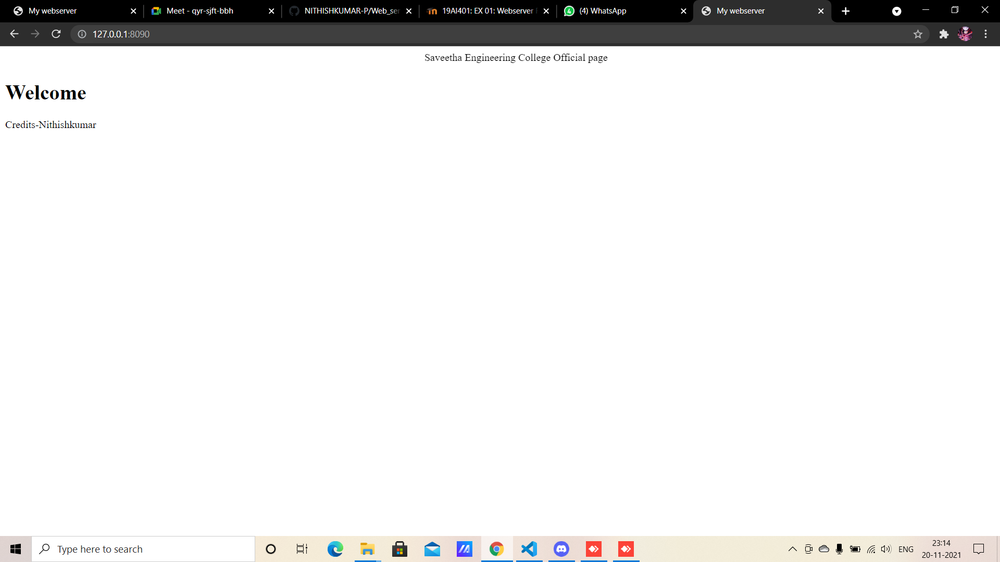

# Developing a Simple Webserver
## AIM:

To develop a simple webserver to serve html pages.
## DESIGN STEPS:
### Step 1:

HTML content creation
### Step 2:

Design of webserver workflow
### Step 3:

Implementation using Python code
### Step 4:

Serving the HTML pages.
### Step 5:

Testing the webserver
## PROGRAM:
```
from http.server import HTTPServer, BaseHTTPRequestHandler
content = """
<!DOCTYPE html>
<html>
<head>
<title>My webserver</title>
</head>
<body>
<<<<<<< HEAD
<big><center>Name: Nithishkumar P</center></big>
      <big><center>Referrence number: 21005889</center></big>
=======
<big><center>Name: Bharath V</center></big>
      <big><center>Referrence number: 21500449</center></big>
>>>>>>> 8e5b649028b43238b62ef6e554c4e7a9934323c1
    <big><center>Department: AI&DS</center></big>
<dl><marquee direction=right><h1><u>Top 5 Programming Language</u></h1></marquee>
<ol type="1">
<li><b>Python</b></li>
<li><b>Java Script</b></li>
<li><b>Java</b></li>
<li><b>CSS</b></li>
<li><b>C++</b></li></dl>
</ol>
</body>
</html>
"""
class myhandler(BaseHTTPRequestHandler):
    def do_GET(self):
        print("request received")
        self.send_response(200)
        self.send_header('content-type', 'text/html; charset=utf-8')
        self.end_headers()
        self.wfile.write(content.encode())
server_address = ('',8091)
httpd = HTTPServer(server_address,myhandler)
print("my webserver is running...")
httpd.serve_forever()
```
## OUTPUT:

## RESULT:
A webserver has been successfully created
